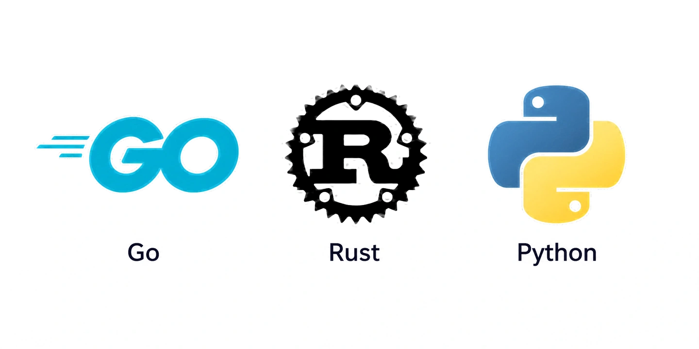

## Intro

1년전 처음 프로젝트를 프로비저닝할 때, 백엔드의 선택은 여지없이 `Spring Boot` 였습니다. 

당시에는 복잡하지 않은 비지니스 로직이었지만 향후 사업의 해자는 앞으로 고객에게 서비스를 제공하면서 발생하는 방대한 데이터를 활용한 효율적인 운영이었고, 그렇기 때문에 데이터베이스를 안정적으로 다룰 수 있도록 성숙한 JPA 를 활용하기 위해서였습니다. (물론 익숙함도 결정의 요소 중 하나였습니다.)

1년 동안 잘 운영하다가, 지난 4월경 백엔드는 `FastAPI` 로, 프론트엔드를 같은 레포에 두면서 static 빌드해 서빙하는 방식으로 변경했습니다. 그러면서 프론트엔드도 `nextjs` 에서 `vite` 로 옮겼습니다. 현재는 변경된 프로젝트로 모두 이관되어 문제없이 운영중입니다. 

마지막 커밋 기준으로 레거시 코드베이스는 작은 규모는 아니었습니다.

|  | 언어 | 파일 수 | 총 라인 | 테스트 제외 라인 수 |
| --- | --- | ---: | ---: | ---: |
| backend | Kotlin (.kt) | 1,778 | 197,947 | 83,068 |
| frontend | TypeScript (.ts/.tsx) | 1,564 | 155,232 | 123,042 |
| **합계** | | **3,342** | **353,179** | **206,110** |

## 처음에는 왜 Spring 이었을까?

첫 삽을 뜨면서 가장 먼저 한 일은 현재 운영을 기준으로 데이터베이스 스키마를 설계하는 것이었습니다.

비지니스 로직은 언제든지 갈아엎을 수 있지만, DB 는 데이터가 쌓이고 테이블들이 관계를 맺기 시작하면 스키마 하나를 바꾸는 일이 점점 비싸집니다. 

그래서, 처음 프로젝트를 만들 땐 ORM 을 가장 중요한 선택의 기준으로 봤습니다. 그 기준에서 `Spring` 은 가장 익숙하고 검증된 선택이었습니다. Spring Data 는 오래 사용된 만큼 레퍼런스가 많고, 복잡한 관계를 가진 데이터 모델을 다루는 방법도 오래 검증돼 있었거든요.

솔직히 복잡한 비지니스 로직을 다루면서 `Spring` 을 이해도 있게 썼느냐 하면 그건 아니었습니다. 다만, Kotlin Spring 을 사용해 여러 토이프로젝트나 사내 플랫폼을 개발한 경험 정도가 있었고, DevOps 엔지니어로 JVM 베이스 서비스에 대한 모니터링 이해도가 있었습니다. 

프론트엔드와 백엔드는 별개의 프로젝트로 관리했고, 각각 배포했습니다. 

이 구조로 약 1년간 문제 없이 개발하고 운영해 왔습니다. `Spring` 을 버려야 겠다고 생각하게 된 건 `Spring` 자체에 문제가 있어서가 아니었습니다. 개발하는 방식이 달라지면서 문제가 보이기 시작했습니다.

## Git Worktree 를 쓰기 시작했습니다.

코딩 에이전트가 점점 발전하고, AI 를 더 적극적으로 사용하기 시작하면서 이슈 하나를 AI 에게 맡겨놓고 기다리는 것보다 Git Worktree 를 만들고, 각각 다른 작업을 진행하는 편이 훨씬 빨라졌습니다.

한 두달 전에는 cmux 를 메인으로 사용하다가, 현재는 orca 를 메인으로 사용해보고 있습니다. 


한 Worktree 에서 기능 A 를 개발하고, 다른 Worktree 에서는 기능 B 를 수정하게 해두고, 완료되면 각각 서버를 다른 포트로 실행해 실제 런타임에서 변경된 동작을 확인하고, 문제가 있으면 AI 에게 피드백을 주는 방식으로 개발 루프가 돌아갑니다.

기존에 단일 `Spring Application` 을 실행하는 건 전혀 문제가 되지 않았습니다. 하지만 이렇게 병렬적인 개발 방식이 자리잡으면서, 독립적인 JVM 프로세스를 여러 개 동시에 실행하고, 변경점을 확인해보기 위한 `Intellij`와 프론트엔드 개발 서버까지 띄우기 시작하니 리소스 부족으로 맥북에서 프로세스를 중단시켜 버리는 일이 잦아졌습니다.

특히 `Spring` 을 사용할때는 좋은 Bean 주입을 추적하고, 타입과 구현체 사이를 이동하고, 여러 추상화를 IDE 를 통해 탐색하는 경험이 좋았기 때문에 `Intellij` 를 띄워 항상 확인해보곤 했는데, 작업이 3-4개만 되어도 워크트리별로 IDE 를 띄워 확인하기가 쉽지가 않아졌습니다. 

AI 와 개발하는 비중이 커지면서, IDE 안에서 코드베이스를 탐색하는 것보다, **여러 작업을 병렬로 수정하고, 각각의 서버를 가볍게 실행해서, 런타임에서 결과를 빠르게 확인하는것**, 이쪽의 가치가 점점 커지고 있었습니다.

`Spring` 이 갑자기 나쁜 프레임워크가 된게 아니라, 제가 일하는 방식이 바뀌고 있던 것이었습니다.

## 프론트엔드, 백엔드 레포 분리의 병목

또 하나의 문제는 프로젝트의 경계였습니다. 

프론트엔드와 백엔드를 별도의 레포지토리로 분리했는데, AI 와 함께 하나의 기능을 처음부터 끝까지 구현하려고 하니 이 경계가 생각보다 자주 걸리기 시작했습니다.

어떤 화면에 새로운 필드 하나를 추가할 때, 백엔드의 Entity, DTO 를 변경하고 API Response 를 변경합니다. 그럼 프론트엔드의 API 인터페이스가 바뀌어야 합니다. 화면의 컴포넌트도 그에 따라 수정되어야 하고, 경우에 따라 validation 이나 mutation 로직도 변경이 필요합니다.

실제로는 하나의 기능 변경인데 코드베이스에서는 두 개의 레포지토리를 넘나들어야 합니다. `/add-dir` 로 어느정도 커버가 되었지만, 1인 개발의 입장에서 레포지토리 분리의 이점이 보이지 않거니와, 점점 이 경계가 줄어가는 상황에서 굳이 레포지토리를 분리해야할까? 라는 생각을 하게 되었습니다.

특히나 지금 같은 초기 스타트업에서는 API 인터페이스는 안정화되어 있지 않습니다. 오늘 결정한 API 가 내일 바뀔수도 있고, 배포 직후 팀원의 피드백으로 바로 수정하기도 합니다.

이런 상황에서, 하나의 기능 변경을 하나의 코드베이스 안에서 AI 가 끝까지 처리할 수 있게 만들고 싶었습니다. 현재처럼 제품의 인터페이스가 빠르게 변화하고 있는 상태에서는 오히려 이쪽이 자연스럽다고 생각했습니다.

그래서 백엔드를 변경하는 김에, 그리고 비지니스가 성장함에 따라 필요해진 새로운 UI 요구사항을 위한 기반을 위해 프론트엔드도 하나의 레포지토리 안에서 관리할 수 있도록 새롭게 설계를 시작했습니다.

## 과도한 배치 리소스

배치는 처음부터 있었습니다. 다만 초기에는 단위가 짧았습니다. 알림을 한 번 내보내거나 상태를 한 번 갱신하고 끝나는 정도여서, 이미 떠 있는 `Spring Boot` 애플리케이션에 배치 엔드포인트를 만들어두고 Kubernetes CronJob 이 `curl` 로 그걸 호출하게 했습니다.

```
Kubernetes CronJob (curl)
        ↓
POST /api/batch/...
        ↓
Spring Boot Server
```

서버가 이미 떠 있으니 부팅 비용이 없고, CronJob 은 스케줄만 관리하면 됩니다. 짧은 작업에는 이걸로 충분했습니다.

데이터가 쌓이면서 상황이 달라졌습니다. 몇 분씩 도는 배치가 필요해졌는데, HTTP Request 하나를 그동안 열어두는 구조는 만들고 싶지 않았습니다. 요청이 타임아웃되면 작업이 어디까지 진행됐는지 알 수 없고, 실패한 배치를 다시 돌리는 것도 결국 `curl` 을 한 번 더 호출하는 일이 됩니다. 무엇보다 배치가 API 서버 프로세스 안에서 돌기 때문에, 무거운 배치 하나가 서버 전체의 메모리를 같이 밀어올렸습니다.

그래서 배치를 독립적인 프로세스로 분리했습니다. `Spring Batch` 를 쓰지는 않았습니다. Job, Step, Reader-Processor-Writer 를 챙겨야 할 만큼 복잡한 배치가 아니었고, 실행 이력과 재시도는 이미 CronJob 이 관리하고 있었습니다. `Spring Batch` 의 메타데이터 테이블까지 얹으면 같은 일을 두 군데서 관리하게 됩니다.

대신 `CommandLineRunner` 를 사용해 HTTP 인터페이스와 나란히 배치 인터페이스를 하나 더 두고, 같은 jar 를 인자에 따라 다르게 실행하게 만들었습니다. 

```
Kubernetes CronJob
        ↓
java -jar project.jar --batch=send-today-repair-alimtalks
        ↓
CommandLineRunner
```

애플리케이션 안에서 스케줄러로 돌리는 방법도 있었지만 형상화가 문제가 됩니다. 어떤 배치가 몇 시에 도는지가 코드 안에만 있고 밖에서는 보이지 않습니다. 배치는 인프라 레이어에서 **플랫폼으로서 관리되어야** 한다고 생각했고, [이전 글](/posts/왜-스타트업에서-day1부터-쿠버네티스를-선택했을까/)에서 쿠버네티스를 선택한 이유 중 하나이기도 했습니다.

의도한 대로 스케줄과 동시 실행 정책, 재시도, 실행 이력은 전부 CronJob 의 필드로 남았습니다. 대신 부팅 비용이 돌아왔습니다.

`CommandLineRunner` 는 애플리케이션 컨텍스트가 다 뜬 다음에 실행됩니다. 테이블 하나를 읽어서 알림톡을 보내는 배치를 돌려도 클래스패스를 스캔하고, 빈을 전부 만들고, 엔티티 메타데이터를 파싱하고, 커넥션 풀을 채운 다음에야 첫 줄이 실행됩니다. 배치 하나를 위해 백엔드 전체를 한 번 더 부팅하는 셈입니다.

길게 도는 배치가 두세 개만 겹쳐도 노드에서 눈에 띄었습니다. 배치가 실제로 하는 일에 비해 잡아먹는 리소스가 너무 컸고, 그만큼 서비스 파드가 스케줄될 여유가 줄었습니다. 다른 방식이 필요했습니다.

## 그렇다고 20만 라인의 프로젝트를 다시 만들 수 있을까

문제를 발견하는 것과 실제로 기술 스택을 바꾸는 것은 전혀 다른 이야기입니다.
AI가 없었다면 아마 여기서 생각을 멈췄을 것 같습니다. 프레임워크를 바꾸기 위해 얻을 수 있는 이득보다 기존 비즈니스 로직을 다시 구현하고 검증하는 비용이 훨씬 컸을 테니까요.

그런데 지금은 이 계산이 달라졌습니다. 제가 이번 마이그레이션을 결정하게 된 가장 큰 이유 중 하나는 **AI 로 인해 코드 마이그레이션의 비용이 저렴해졌다** 는 것 이었습니다.

최근 Bun 은 53만 라인의 Zig 코드를 11일 만에 Rust 로 옮겼습니다. 규모는 비교가 안 되지만 눈에 들어온 건 [Bun에서 남긴 회고](https://bun.com/blog/bun-in-rust)였습니다. 테스트를 하나도 건너뛰지 않은 채로 옮겼고, 남은 리그레션은 대부분 **두 언어에서 문법은 같은데 의미가 다른 코드**에서 나왔다고 합니다.

테스트는 이미 두껍게 쌓여 있었습니다. 다만 안정적인 마이그레이션 보다는 **앞으로의 확장과 속도**에 초점을 맞췄습니다. `/v2` 엔드포인트를 신규 백엔드에 만들고, 반대로 레거시에서 만들어 두고 더이상 쓰지 않는 인터페이스를 이번에 모두 정리하기로 했습니다.

## Go, Rust, 그리고 Python



`Spring` 을 떠나기로 하고 나서는 세 가지를 놓고 고민했습니다. Go, Rust, Python 이었습니다.

개인적으로 `Go` 를 굉장히 좋아합니다. 가볍고 코드가 단순하고 서버를 하나 띄우는 비용이 작습니다. 앞에서 이야기한 병렬 개발 환경과도 잘 맞습니다. 워크트리마다 서버를 하나씩 띄워도 **Go Runtime 은 JVM 처럼 부담되지 않습니다.**

다만 Go 에서 걸린 지점은 ORM 생태계였습니다. `GORM` 도 모델과 Association, Preload, Migration 등 필요한 기능을 다 제공합니다. 다만 Go 생태계에는 `GORM` 외에도 `Ent` 처럼 코드 생성을 적극적으로 활용하거나, 아예 SQL 을 직접 작성하고 sqlc 로 타입 안전한 코드를 생성하는 접근도 널리 사용됩니다. 어느 쪽이 더 낫다기보다는 Go 에서는 데이터베이스를 다루는 방법 자체에 여러 선택과 트레이드오프가 있다고 느꼈습니다.

`Rust` 도 고민했습니다. 개인적으로 굉장히 궁금하고 언젠가 제대로 써보고 싶은 언어입니다.

하지만 제품의 요구사항이 계속 변하는 상황에서, **언어를 배우면서 동시에 새로운 생태계의 시행착오까지 AI 와 함께 겪는 건** 지금 최적화할 대상이 아니라고 판단했습니다.

결국 `Python` 이 남았습니다.

`Python` 을 타입 때문에 꺼려야 하는 언어라는 말은 이제는 오래된 이야기이고, Type Hint 와 정적 타입 체킹을 충분히 활용할 수 있습니다. `Pydantic` 과 `FastAPI` 를 사용하면 API 의 데이터 모델도 꽤 명시적으로 관리할 수 있습니다.

ORM 측면에서는 `SQLAlchemy` 와 `Alembic` 이 오랜 시간 ORM 과 마이그레이션 영역에서 쌓아온 기능과 레퍼런스가 충분했습니다. 지금처럼 데이터 모델 자체가 계속 바뀌는 시기에는 새로운 DB 접근 방식을 고민하는 것보다, 익숙하고 성숙한 추상화 위에서 빠르게 모델을 바꾸는 쪽이 저희에게 더 중요했습니다.

추가로 런타임이 가벼워 AI 가 코드를 쓰고, 바로 실행하고, 결과를 확인하고, 다시 수정하는 지금의 개발 루프와 잘 맞았습니다.

그리고 **AI 생태계가 Python 위주로 굴러간다는 점도 컸습니다.** 저희는 이미 제품 안에서 AI 프레임워크를 쓰고 있었습니다. 스키마를 임베딩해두고 사내 데이터 분석 툴에 쓴다거나, 상담을 요약해 니즈를 뽑는데 사용하기도 합니다. 앞으로 커스텀 에이전트 등 AI 프레임워크를 적극적으로 사용해야 할 일이 많아질게 분명했습니다. 새로운 모델이나 라이브러리가 나오면 Python SDK 가 먼저 나오고, 예제도 Python 으로 먼저 씁니다. 어차피 AI 를 붙일 일이 계속 생긴다면 그게 자연스럽게 되는 쪽에 서 있는 편이 낫다고 봤습니다.

그래서 FastAPI 를 선택했습니다.

## 마이그레이션

마이그레이션은 API 와 UI 를 그대로 옮겨가는 형식이 아니었습니다. 세 갈래로 나눠서 진행했습니다.

1. 빠르게 실험하기 위해 만들었다가 사용하지 않게된 API 들을 정리하고,
2. 외부 노출된 API 들은 Spring 백엔드와 신규 FastAPI 백엔드를 동시에 띄워두고 여러 요청에 대한 응답값을 검사하는 방식으로 마이그레이션했습니다. 
3. /v2 로 새로운 프론트엔드와 동작해야할 API 들은 최대한 DB 스키마 변경 없이 프론트엔드와 병렬 개발을 진행했습니다.

배치는 새로운 활로를 찾았습니다.
`CommandLineRunner` 와 유사한 형태로, `uv run` 을 활용하여 배치 인터페이스에서 Python 스크립트를 실행함으로써 서버 코드베이스(이미지)를 그대로 재사용하면서 리소스는 최소로 줄였습니다. 길게 돌아가는 배치도 이제 부담 없이 띄울 수 있어서, 기존 curl 배치 엔드포인트는 제거하고 모두 통합했습니다.

신규 운영 UI 와 레거시를 함께 띄워두고 레거시를 하나씩 걷어냈고, 결국 `FastAPI` 로 다 옮겼습니다.

## 실제 효과가 있었나요?

글을 작성하면서 한 번 세어봤습니다. 레거시 두 레포와 신규 레포의 git 히스토리, 그리고 Linear 이슈를 그대로 긁었습니다. 

| 구간 | 기간 | 활동일 | 머지 PR | 작업 단위 | 순증 라인 |
| --- | --- | ---: | ---: | ---: | ---: |
| 기존 | 2025-02-15 ~ 2026-05-19 (458일) | 341 | 1,987 | 433 | 353,171 |
| 신규 | 2026-04-16 ~ 2026-08-28 (134일) | 117 | 881 | 876 | 761,488 |

레거시는 필드 하나를 추가해도 백엔드 PR 과 프론트엔드 PR 이 따로 올라갑니다. PR 하나가 기능의 절반인 셈이라, 두 레포에서 **같은 날 같은 브랜치로 올라간 PR 을 하나로 묶어** 작업 단위를 셌습니다. 레거시 1,987건이 433개 단위로, 신규 881건이 876개 단위로 묶입니다. 크기는 GitHub 이 계산한 PR diff 를 그대로 씁니다.

| 지표 | 레거시 | 신규 | 배율 |
| --- | ---: | ---: | ---: |
| 작업 단위 / 활동일 | 1.3 | 8.5 | 6.5× |
| 작업 단위당 추가 라인 (중앙값) | 576 | 381 | 0.66× |
| 작업 단위당 변경 파일 (중앙값) | 25 | 12 | 0.48× |
| 하루 추가 라인 (중앙값) | 1,348 | 6,378 | 4.7× |
| 순증 라인 / 활동일 | 1,036 | 6,174 | 6.0× |
| 새 이슈가 생기는 간격 | 7.8시간 | 2.3시간 | 3.4× 짧아짐 |

누적 코드 라인을 각 프로젝트의 시작일에 맞춰 겹쳐 그리면 차이가 더 분명하게 보입니다.

")

레거시가 458일에 걸쳐 쌓은 353,171 줄을, 신규 프로젝트는 **37일 만에 통과**했습니다.

그래프 왼쪽 끝에 회색으로 칠한 2주가 **마이그레이션 그 자체**입니다. 옮기는 데 한 주, 두 스택을 같이 띄워두고 응답을 비교하는 병행 운영에 한 주를 썼습니다. 그래서 앞의 표는 이 2주를 빼고 셌습니다. 빼기 전과 후가 크게 다르지도 않았습니다. 신규 레포의 활동일당 순증은 6,565줄에서 6,174줄이 되고, 작업 단위당 추가 라인 중앙값은 381줄 그대로입니다. **마이그레이션으로 벌어놓은 수치가 아니라 그 뒤로도 같은 속도가 유지**됐다는 뜻입니다.

이슈는 Linear 에서 티켓 운영이 자리잡은 구간만 놓고 셌습니다. 레거시는 2025년 7월부터 11월까지, 신규는 2026년 5월부터 지금까지입니다. 그 사이 새 이슈 하나가 생기는 간격이 평균 7.8시간에서 2.3시간으로 줄었습니다.

표에서 눈에 띈 건 **작업 단위가 오히려 작아졌다**는 쪽이었습니다. 한 작업이 건드리는 코드가 576줄에서 381줄로, 파일이 25개에서 12개로 줄었습니다. 대신 그 작업을 하루에 1.3개 하다가 8.5개 합니다. 덩어리를 더 잘게 쪼개서 더 자주 머지하게 됐습니다. 워크트리를 작은 단위로 나눠 빠르게 검증하고 올리는 횟수가 늘었습니다. 

물론 라인 수가 늘어난 게 그 자체로 좋은 일은 아닙니다. 같은 도메인을 다루는데 코드베이스는 2.1배가 됐습니다. Python 이 Kotlin 보다 장황해서만은 아니고, 테스트와 계층 분리가 파일 수를 같이 키웠습니다.

## 마무리하며

요즘 제가 가장 많은 시간을 쓰는 곳은 기능을 하나 더 만드는 쪽이 아니라 **AI 와 함께 개발 및 운영의 속도와 효율 자체를 끌어올리는 쪽**입니다. 무엇을 에이전트에게 맡기고 무엇을 직접 확인할지 같은 것들입니다. 이번 마이그레이션도 결국 그 연장선에 있었습니다.

이 선택이 계속 맞을 거라고 생각하지는 않습니다. 지금은 스키마가 자주 바뀌고 인터페이스가 하루 만에 뒤집히고 있어 이 구성이 맞았지만, 비지니스가 성숙해지고 도메인이 굳고 함께 일하는 사람이 늘어나면 기준은 또 달라집니다. 그때는 레포를 다시 쪼개거나, 지금 버린 것들을 다시 주워오는 글을 쓰게 될지도 모릅니다. ~~그때도 옮기는 건 AI 가 하겠죠?~~

조건 없는 정답지는 없다고 생각합니다. `Spring` 이 나쁜 선택이었던 적은 한 번도 없었고, 지난 1년 동안 비지니스를 여기까지 데려온 것도 `Spring` 이었습니다. 달라진 건 조건이었습니다. **지금 주어진 조건에서 얼마나 효율을 찾아내느냐**가 관건이라고 봅니다.

적어도 지금 시점에서는, 이 마이그레이션의 선택과 결과에 만족하고 있습니다.

여러분은 요즘, AI 로 인해 개발의 방식을 어떻게 바꿔가고 계신가요?
